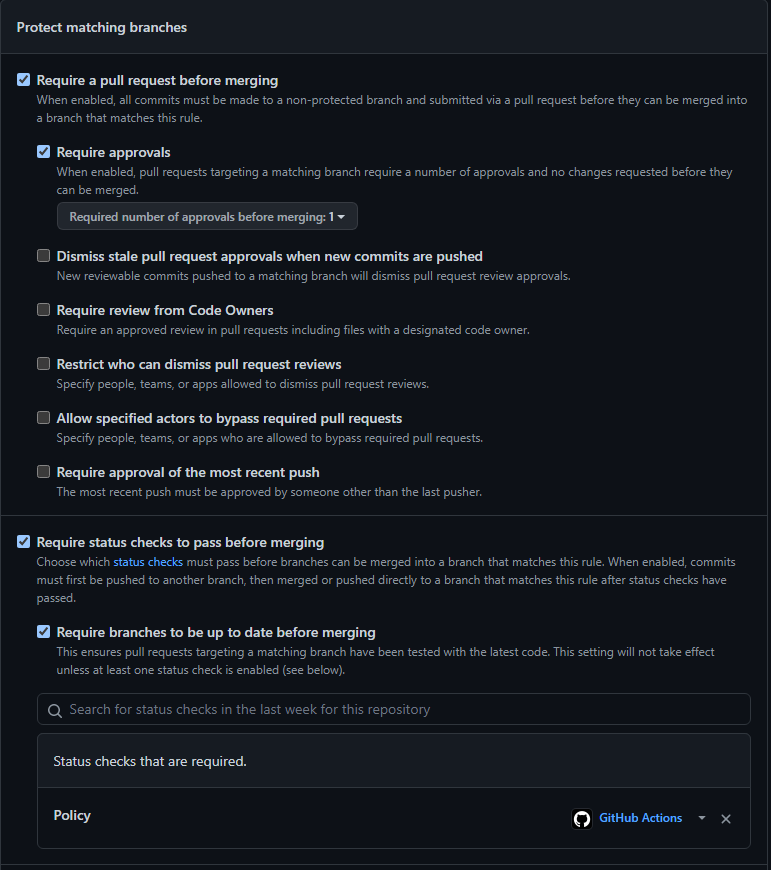
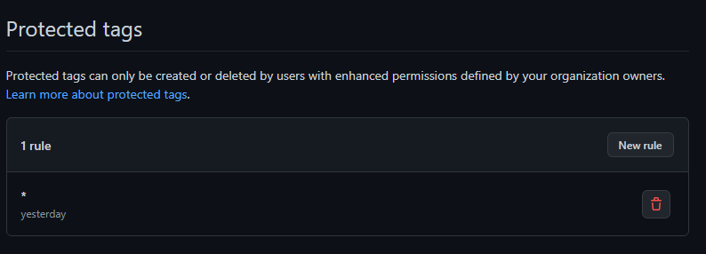
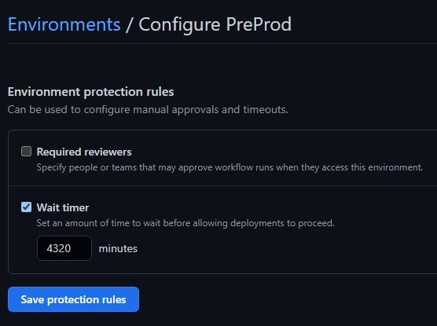
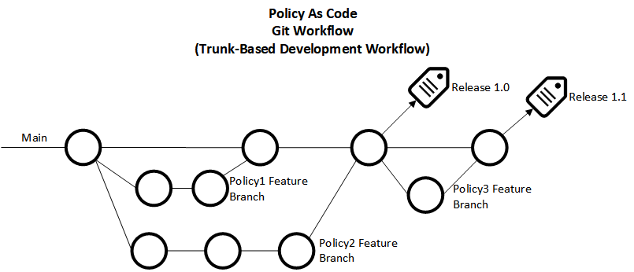
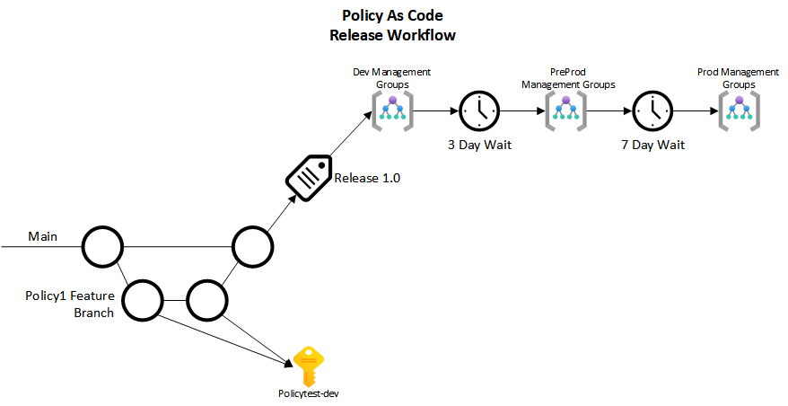
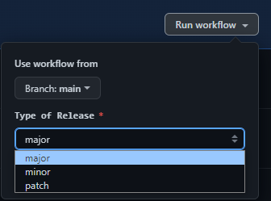

# Enterprise Azure Policy as Code Demo - Advanced

## Table of Contents

- [Overview](#overview)
- [General Terminology](#general-terminology)
- [Initial Setup](#initial-setup)
- [Branching and Release Strategy](#branching-and-release-strategy)
  - [Development Process](#development-process)
  - [Merging Process](#merging-process)
  - [Release Strategy](#release-strategy)
- [GitHub Actions Workflows](#github-actions-workflows)
  - [Feature Branch Deployment](#feature-branch-deployment)
  - [Release Creation](#release-creation)
  - [Release Deployment](#release-deployment)
- [Best Practices](#best-practices)
  - [Semantic Versioning](#semantic-versioning)
- [Process](#process)
- [Original Source](#original-source)
- [References](#references)

 

> **Desired State Warning**
>
> This solution uses the desired state strategy. It will remove any custom Policies, Initiatives or Policy Assignments not duplicated in the definition files.

 

## Overview

This repo is a central repository of all Azure policies. This allows for a "Policy as Code" approach to guardrails and would be able to avoid long term drift of how policies should be applied to how they are actually applied. Any changes to Azure Policy done outside this repo will be reset the next time a GitHub Action in this repo runs.

 

## General Terminology

Azure Policy is broken into 3 distinct resources, Definitions, Assignments, and Exemptions

| Name            | Description                                                                                                                                                                                                                                                                                                                                                                                                                                                                                                                                                                                                                                                                                                                                                                                                                                 |
| --------------- | ------------------------------------------------------------------------------------------------------------------------------------------------------------------------------------------------------------------------------------------------------------------------------------------------------------------------------------------------------------------------------------------------------------------------------------------------------------------------------------------------------------------------------------------------------------------------------------------------------------------------------------------------------------------------------------------------------------------------------------------------------------------------------------------------------------------------------------------- |
| **Definitions** | The journey of creating and implementing a policy in Azure Policy begins with creating a policy definition. Every policy definition has conditions under which it's enforced. And, it has a defined effect that takes place if the conditions are met.[^def]                                                                                                                                                                                                                                                                                                                                                                                                                                                                                                                                                                                |
| **Assignments** | An assignment is a policy definition or initiative that has been assigned to a specific scope. This scope could range from a management group to an individual resource. The term scope refers to all the resources, resource groups, subscriptions, or management groups that the definition is assigned to. Assignments are inherited by all child resources. This design means that a definition applied to a resource group is also applied to resources in that resource group. However, you can exclude a subscope from the assignment.   Policy assignments always use the latest state of their assigned definition or initiative when evaluating resources. If a policy definition that is already assigned is changed all existing assignments of that definition will use the updated logic when evaluating. [^assign] |
| **Exemptions**  | (Future Implementation) The Azure Policy exemptions feature is used to exempt a resource hierarchy or an individual resource from evaluation of initiatives or definitions. [^exempt]                                                                                                                                                                                                                                                                                                                                                                                                                                                                                                                                                                                                                                                       |

 

## Initial Setup

When this process is originally created for use, there are a few initial steps to be able to start

1. 3 Service Principals were created for this application that will be described later:
   - SPN-Plan
   - SPN-Deploy
   - SPN-Roles
2. Update the "global-settings.jsonc" file located under the Definitions folder. For more information, see [here](Definitions/README.md)
3. Setup GitHub Action Secrets. There are 5 secrets that are needed:
   - **Service Principal Client IDs** - These are the Client IDs of the 3 Service Principals that were created during step 1
     - _DEPLOY_CLIENT_ID_
     - _PLAN_CLIENT_ID_
     - _ROLES_CLIENT_ID_
   - **Tenant_ID** - This is the Tenant ID of the Azure AD Tenant
   - **PAT** - This is a Personal Access Token from GitHub. This is used in one of the GitHub Action Workflows to trigger additional workflows
4. Create Branch Protections

   - There should be a branch protection for "Main" setup as shown below

   

5. Create Protected Tags

   - All Tags should be set to protected to prevent others from creating releases around the process

   

6. Create 7 Environments; PolicyAsCode-dev, Sandbox, Dev, PreProd, Production, Regulatory, and platform

   - Configure any special requirements for each environment

   

 

## Service Principals

The use of 3 Service Principals is to follow the concept of least permissions. 1 SPN has the ability to read into Azure AD, but no write abilities to anything. The other 2 do not get read access to Azure AD, but they do get write access into Azure. These 3 Service Principals do not need to have a Secret generated as it authenticates over OIDC between GitHub and Azure AD.

### SPN-Plan

This Service Principal is responsible for generating the plan of what changes exist between the Policy as Code Repo and policies within Azure. In addition, it will review the RBAC permissions that may need applied with DeployIfNotExists Policies.

The permissions it has includes the ability to read everything in addition to having some read access to Azure AD.

### SPN-Deploy

Once the plan has been generated using the Service Principal above, this Service Principal is used to apply the Azure Policy changes. This Service Principal uses the built-in role titled "Resource Policy Contributor" to modify Azure Policy with little access outside of that.

### SPN-Roles

The final Service Principal is the Roles SPN. This SPN is only used when RBAC changes are required for an Azure Policy to work. It has the role "User Access Administrator" to accomplish this goal.

### OIDC Authentication

To avoid the use of maintaining and rotating Service Principal secrets, this repo has OIDC/Federated Credentials implemented. This is setup by creating a Federated Credential within Azure AD specifying exactly which GitHub Organization, Repo, and then branch/tag/environment. Due to the very limited scope of how it can authenticate, it becomes much more secure. There is currently a limitation of 10 Federated Credentials per Service Principal so it cannot be used for every scenario. Once setup on Azure AD, GitHub Actions only needs the Client ID and the Tenant ID. While both of these values are not sensitive, they are stored as secrets to make it easier to reference and cycle if needed.

If new federated credentials are needed, a small script has been created to assist. It can be located at [Scripts/GitHubActionsOIDC.ps1](./Scripts/GitHubActionsOIDCAdd.ps1).

## Branching and Release Strategy

This Policy as Code repo uses Trunk-Based Development Workflow[^trunk] to create/modify/delete policies. This methodology allows the ability to batch multiple Policy changes together and deploy as one release instead of having multiple small releases close together.

### Development Process

Any time something needs changed, the person making the change will create a new branch off the "main" branch. These branches are collectively called "Feature Branches". The specific name for each branch is up to the user, but should be a short descriptive name for what will happen in the branch. When a feature branch has commits made to them, it will trigger the [Feature Branch Deployment Workflow](#feature-branch-deployment). That workflow will deploy the policies to the Azure subscription setup in the "global-settings.jsonc" file under PolicyAsCode-dev.

> **Caution**
>
> Only 1 test environment exists. If multiple feature branches are being used simultaneously, each commit will overwrite the changes of the other feature branch. This can be worked around by sharing a feature branch on the rare times multiple changes are happening simultaneously.

### Merging Process

Once a policy has been created and validated within that subscription, a pull request will be opened to merge into the Main Branch. The Pull Request will need to be reviewed by 1 other person to validate the changes before it can be merged. After merging the feature branch, the branch can be deleted.

An example of the development lifecycle:

### Release Strategy

Once a change or group of changes has been decided on, a release is created through a [GitHub Actions workflow](#github-actions-workflows). The Actions will create a tag signifying the version that will be released. After that, the policies will be rolled out through the environments.

An example of the policy release process:

 

## GitHub Actions Workflows

### [Feature Branch Deployment](./.github/workflows/FeatureBranchDeployment.yml)

The Feature Branch Deployment workflow is triggered anytime there is a commit to a branch not called "main". As an example in the diagrams above, this workflow would be triggered by any of the commits in Policy1, Policy2, or Policy3 Feature Branches. The workflow deploys all the policies from the feature branch into the "Policytest-dev" subscription.

### [Release Creation](./.github/workflows/PolicyReleaseCreation.yml)

The Release Creation Workflow is started manually through the portal. This is to facilitate the ability to bulk multiple changes together instead of doing multiple small releases close together. When a user starts the workflow, they have to select whether the release is a major, minor, or patch. See [Semantic Versioning](#semantic-versioning) to learn more.

Once a type has been selected and the workflow starts, it calculates the next version that should be made, creates a release tag, and attaches the current commit to the tag.

> **Note**
>
> This GitHub Actions Workflow triggers the Release Deployment Workflow automatically. Due to this, The standard GITHUB_TOKEN cannot be used as it does not have permissions to trigger other workflows. To overcome this issue, a Personal Access Token (PAT) is used in its place.

### [Release Deployment](./.github/workflows/PolicyReleaseDeployment.yml)

The final workflow that gets ran is the Release Deployment workflow. This workflow is responsible for actually deploying the policies out to the Azure environments. See the [release strategy section](#release-strategy) above to review the steps and timing of each.

 

## Best Practices

### Semantic Versioning

Azure Policy releases follow semantic versioning, major.minor.patch (example: 1.2.3). The definitions for each have been adapted from the industry standard, [semver.org](https://semver.org/)

- Major - A major release is used when a policy is created/modified that could impact a large amount of different resource types. Examples could be; the requirement of new/modified tags or VNET related policies
- Minor - A minor release could still impact resources, but the impact would be limited to a single resource type (Example: Azure WebApps). Examples of these kinds of policies would be; requiring HTTPS on all Azure WebApps or Require TLS on SQL Databases
- Patch - Patch would be used in the case of a small change that would not impact resources. This could be for adding in exemptions, adding resources/resource groups to policy definitions that cannot support the policy, or hotfixes like a mistype in a policy definition.

 

## Process

1. Create a branch with a short descriptive name of what is being built
2. Create the policy definition. More information can be found [here](./Definitions/policyDefinitions/README.md)
3. Create assignments file. More information can be found [here](./Definitions/policyAssignments/README.md)
4. Commit as needed to review the changes and test the policies
5. Once everything is validated to be working, open a pull request to the main branch
6. Have a teammate review the pull request and approve it
7. Merge the feature branch into Main
8. Once ready, start the [workflow](#release-creation) to create a release

 

## Original Source

https://github.com/Azure/enterprise-azure-policy-as-code

 

## References

[^def]: https://learn.microsoft.com/en-us/azure/governance/policy/overview#policy-definition
[^assign]: https://learn.microsoft.com/en-us/azure/governance/policy/overview#assignments
[^exempt]: https://learn.microsoft.com/en-us/azure/governance/policy/concepts/exemption-structure
[^trunk]: https://trunkbaseddevelopment.com/
[^effect]: https://learn.microsoft.com/en-us/azure/governance/policy/concepts/effects
